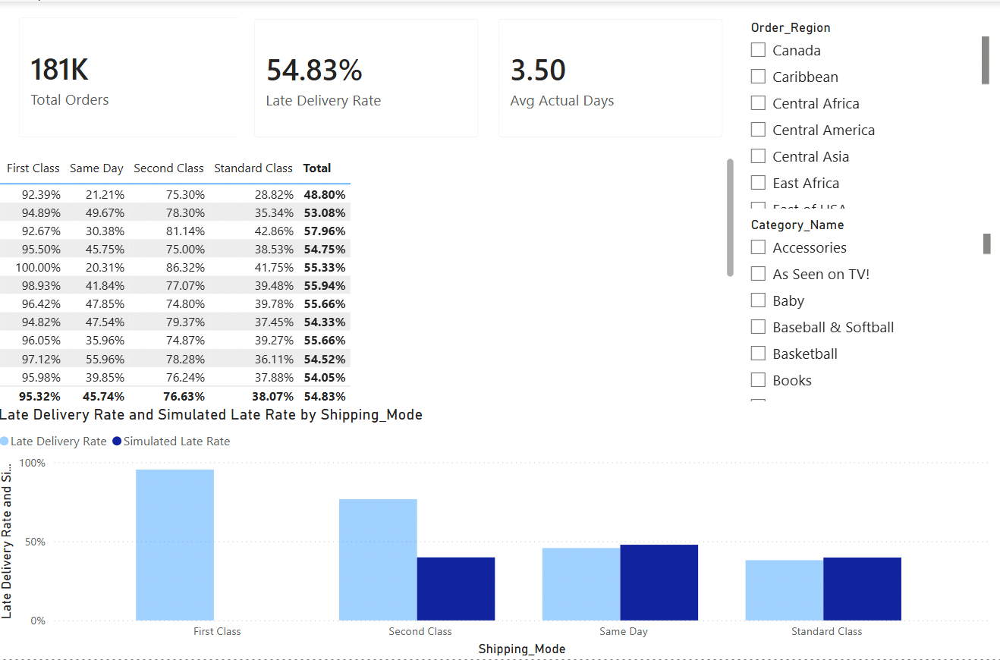

# Supply Chain Delivery SLA — Root Cause Analysis

Diagnosing why 54.8% of orders in a supply chain dataset arrive late, ruling out
confounding factors with statistical tests, cross-validating the root cause with
an independent machine learning method, and quantifying the impact of a policy fix.

## Key finding

> **Shipping mode's promised delivery time is the root cause of 54.8% of orders
> arriving late — not region, product category, or order size.** Adjusting the
> SLA promise to match real operational capability would cut the late rate to
> **34.1%** (a 20.7 percentage point improvement).

This conclusion is independently confirmed by two different methods (see
[Methodology](#methodology) below): manual statistical validation and a
Random Forest cross-check.

## Project structure

```
.
├── 01_clean_data.py                   # Data cleaning (encoding fix, PII removal, type conversion)
├── 02_eda_analysis.py / .ipynb        # EDA + statistical root cause validation
├── 03_random_forest_validation.py / .ipynb   # Independent ML cross-validation
├── supply_chain_dashboard.pbix        # Power BI dashboard (DAX measures, matrix, slicers)
├── charts/                            # All exported figures from Python (PNG)
└── screenshots/                       # Power BI dashboard screenshots
```

Each analysis stage ships as a `.py` **and** a `.ipynb`. They're paired with
[jupytext](https://jupytext.readthedocs.io/): the `.py` is the source of truth
(clean to read and diff), the `.ipynb` is the same code executed with outputs
embedded, so charts render directly on GitHub without needing to run anything.

## Data

[DataCo Supply Chain Dataset](https://www.kaggle.com/datasets/shashwatwork/dataco-smart-supply-chain-for-big-data-analysis)
(Kaggle), ~180,500 orders, 53 columns. Raw and cleaned CSVs are **not** committed
to this repo (both exceed/approach GitHub's 100MB file limit) — download from
Kaggle and place `DataCoSupplyChainDataset.csv` in the project root to reproduce.

## Methodology

**1. Cleaning** (`01_clean_data.py`)
Fixed ISO-8859-1 encoding, dropped a fully-null column and PII fields, converted
date strings to datetime, standardized column names.

**2. EDA + statistical validation** (`02_eda_analysis`)
- Found the headline number: 54.8% of orders are late
- Broke it down by `Shipping_Mode` and found a counterintuitive pattern: faster/
  pricier shipping options have *higher* late rates (First Class: 95.3%, Standard
  Class: 38.1%)
- **Ruled out confounders** before trusting that pattern: checked late-rate
  standard deviation across 22 regions (σ < 3.3pp) and 14 product categories
  (σ < 2.1pp), and correlation between order size (sales/quantity) and late risk
  (|r| < 0.005) — none of these explain the variation
- Identified the actual root cause: promised delivery days (SLA) are set below
  what operations can actually deliver, especially for First Class (promises 1
  day, takes 2) and Second Class (promises 2, takes ~4)
- Simulated a corrected SLA and recalculated the late rate: **54.8% → 34.1%**

**3. Random Forest cross-validation** (`03_random_forest_validation`)
Rather than trusting one method, this stage asks the same question — *is there
anything beyond shipping mode driving delays?* — with an independent statistical
approach:
- Compared a baseline model (`Shipping_Mode` only) against a full model (+ region,
  category, market, sales, quantity, customer segment). Excluded the promised-days
  field itself since it's a 1:1 encoding of shipping mode and would just split
  importance between two copies of the same information — not new signal
- On a held-out test set, the full model's AUC was *lower* than the baseline
  (0.708 vs 0.729) — additional features added noise, not signal
- Used permutation importance (not impurity-based importance, which is biased
  toward high-cardinality features like the 50-category `Category_Name`) to
  confirm: `Shipping_Mode` importance (0.159) is ~30x the sum of every other
  variable, several of which were slightly negative (pure noise)

Two independent methods, same conclusion — this is what makes the root cause
diagnosis robust rather than a one-off pattern in a single statistic.

## Power BI dashboard

An interactive version of the same findings, built for stakeholders who'd
rather click through filters than read a notebook.



- **Calculated columns**: `New_Scheduled_Days` (a corrected SLA per shipping
  mode) and `New_Late_Delivery_Risk` (recomputed late flag under that
  correction) — these reproduce the Python policy simulation directly in DAX
- **Measures**: `Total Orders`, `Late Delivery Rate`, `Avg Promised/Actual
  Days`, `SLA Gap (Days)`, `Simulated Late Rate`, `Improvement (pp)`
- **Region × Shipping Mode matrix**: the same confounder check from the EDA
  stage, rebuilt as an interactive table — every region's `Late Delivery Rate`
  is visible at once, confirming the pattern holds everywhere
- **Before/after chart**: `Late Delivery Rate` vs `Simulated Late Rate` side
  by side per shipping mode, the clearest single visual of the policy fix's
  impact
- **Slicers** on `Order_Region` and `Category_Name` let a viewer check whether
  the conclusion holds for any specific slice of the business, without
  touching the underlying model

The DAX measures were built to match the Python numbers exactly (54.83%
overall late rate, same per-mode breakdown) — having two independent
implementations agree is itself a sanity check that neither has a bug.

## Tools

Python (pandas, scikit-learn, matplotlib, seaborn) for cleaning, statistical
validation, and machine learning cross-checks. Power BI (DAX measures,
calculated columns, interactive matrix and slicers) for a stakeholder-facing
version of the same findings.

## Limitations

`First Class` shipping has zero variance in actual delivery days in this dataset
(always exactly 2 days), which is unusual for real-world logistics data and may
reflect some simplification in how the dataset was generated. Findings here
should be re-validated against longer-horizon, more dispersed real operational
data before being used for an actual policy decision.
